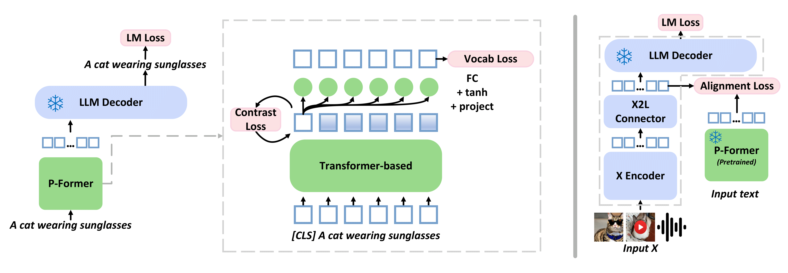

# Bootstrapping Vision-Language Learning with Decoupled Language Pre-training

This repo covers implementations of BLIP2 with Pformer in **[Bootstrapping Vision-Language Learning with Decoupled Language Pre-training](https://arxiv.org/abs/2307.07063)**. The paper is accepted to NeurIPS 2023. The code is developed based on [LAVIS](https://github.com/salesforce/LAVIS/) project (cloned on Feb 23, 2023).



We mainly add following files in `lavis/models/blip2_models`:

- [x] `blip2_pformer_opt.py`
- [x] `blip2_pformer_t5.py`
- [x] `blip2_pformer.py`
- [x] `pformer_opt.py`
- [x] `pformer_t5.py`

We also edit `lavis/models/base_model.py` to allow training from scratch, and include new `dataset` and `dataloader` in `lavis/datasets` of pure sentence dataset for training P-Former.

## Installation

```bash
conda create -n lavis python=3.8
conda activate lavis
pip install -e .

pip install torch==1.13.1+cu117 torchvision==0.14.1+cu117 torchaudio==0.13.1 --extra-index-url https://download.pytorch.org/whl/cu117
```

## Data Preparation
Please follow instructions from [LAVIS](https://github.com/salesforce/LAVIS/) to download pre-training datasets.

## Training
stage 0 (training P-Former)
```bash
bash run_scripts/blip-T/train/pretrain_stage0.sh
```

stage 1 (training Q-Former with pre-trained P-Former)
```bash
bash run_scripts/blip-T/train/pretrain_stage1.sh
```

stage 2 (End-to-end BLIP2 with pre-trained P-Former)
```bash
bash run_scripts/blip-T/train/pretrain_stage2.sh
```

finetuning on MSCOCO
```bash
bash run_scripts/blip-T/train/train_caption_coco.sh
```

## Pretrained Models
models trained with 4M data:
- [x] [our_stage0 (`models/ours/stage0`)](https://www.dropbox.com/scl/fo/hj2mmetbergeq3s81lpus/h?rlkey=bxpwgthbk5fg0gmw0s7jt4ctk&dl=0)
- [x] [our_stage1 (`models/ours/stage1`)](https://www.dropbox.com/scl/fo/hj2mmetbergeq3s81lpus/h?rlkey=bxpwgthbk5fg0gmw0s7jt4ctk&dl=0)
- [x] [our_stage2 (`models/ours/stage2`)](https://www.dropbox.com/scl/fo/hj2mmetbergeq3s81lpus/h?rlkey=bxpwgthbk5fg0gmw0s7jt4ctk&dl=0)
- [x] [blip2_stage1 (`models/ours/stage1`)](https://www.dropbox.com/scl/fo/hj2mmetbergeq3s81lpus/h?rlkey=bxpwgthbk5fg0gmw0s7jt4ctk&dl=0)
- [x] [blip2_stage2 (`models/ours/stage2`)](https://www.dropbox.com/scl/fo/hj2mmetbergeq3s81lpus/h?rlkey=bxpwgthbk5fg0gmw0s7jt4ctk&dl=0)

## Evaluation
```bash
bash run_scripts/blip-T/eval/eval_gqa_zeroshot_opt2.7b.sh
bash run_scripts/blip-T/eval/eval_okvqa_zeroshot_opt2.7b.sh
bash run_scripts/blip-T/eval/validate_vqa_zeroshot_opt2.7b.sh
bash run_scripts/blip-T/eval/eval_cap_coco_opt2.7b.sh
```

## Training and Evaluation Logs
You can find our training and evaluation logs [here](training_logs/).

## Acknowlegements
The code is developed based on [BLIP2](https://openreview.net/forum?id=KU9UojoX7U) and [LAVIS](https://github.com/salesforce/LAVIS/) project.

## Citation
```bibtex
@inproceedings{
    jian2023bootstrapping,
    title={Bootstrapping Vision-Language Learning with Decoupled Language Pre-training},
    author = {Jian, Yiren and Gao, Chongyang and Vosoughi, Soroush},
    booktitle={Thirty-seventh Conference on Neural Information Processing Systems},
    year={2023},
    url={https://openreview.net/forum?id=8Kch0ILfQH}
}
```
